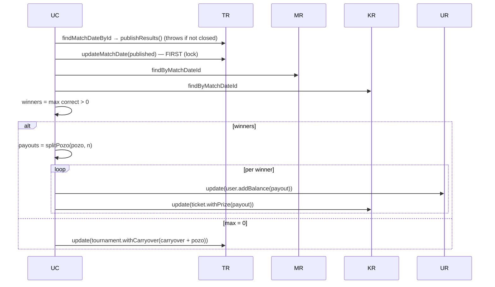

# Design: Modelo 1 — Real-Money Pozo

## Technical Approach

Persist SystemConfig (single row, boot-loaded shared ref), fix both broken wirings (`allowRegistration` copied by value; close using `tournament.commission`), snapshot pozo+commission at close, credit commission to the closing admin, and wire the existing-but-unrouted `PublishResultsUseCase` to `POST /api/admin/dates/:dateId/publish-results`, paying winners or rolling pozo into `tournaments.carryover`. Hexagonal style: snapshot/create entities, ports in `domain/ports/`, Drizzle repos, Zod in routes. Money in integer cents.

## Architecture Decisions

| # | Choice | Rationale |
|---|--------|-----------|
| D1 | New `system_config` table, single row id=1 | Survives cold starts; file not live-updatable |
| D2 | Boot `repo.get() ?? DEFAULTS` → shared ref; update mutates ref + `upsert()` | Live reads, 1 boot query; reload-per-request is N+1 |
| D3 | `config` ref through router → auth → RegisterUseCase; read at execute | Fixes by-value copy |
| D4 | Close uses `config.commission`, not `tournament.commission` | System-config is source; tournament field informational |
| D5 | `pozo = PozoCalculator(gross−commission).cents + carryover`; then `withCarryover(0)` | Calculator stays pure |
| D6 | `match_dates.commission`; `MatchDate.withCommission(pct)` immutable | Closed dates never recomputed |
| D7 | Guard INSIDE use case: `publishResults()` throws if not closed → `DateNotClosedError` (409) | Re-submit cannot double-pay |
| D8 | Winners = max correct > 0, ascending ticketId; `splitPozo` floor + remainder to winners[0] | Deterministic "first winner" |
| D9 | Save `results` transition FIRST, then credits, then carryover | No UoW infra; no double-pay on retry |
| D10 | `DateNotClosedError` (409) DomainError | errorHandler maps DomainError→status |

## Data Flow

### Close date

```mermaid
sequenceDiagram
    UC->>TR: findMatchDateById → close()
    UC->>TR: findById (carryover)
    UC->>KR: countByMatchDateId
    UC->>PR: calculate(count, bet, Commission(config.commission))
    UC->>UC: pozo = base + carryover; commission = gross − base
    UC->>TR: updateMatchDate(withPozo + withCommission)
    UC->>TR: update(tournament.withCarryover(0))
    UC->>UR: update(admin.addBalance(commission))
    UC->>AR: save(AuditLog 'commission_payout')
```

### Publish results



## File Changes

| File | Description |
|------|-------------|
| `db/schema.ts` | `system_config` table; `matchDates.commission`; `tournaments.carryover`; `tickets.prizeWon` |
| `server/drizzle/0001_*.sql` (Create) | Migration + meta snapshot |
| `domain/entities/system-config.ts` (Create) | `SystemConfig` + `DEFAULT_SYSTEM_CONFIG` |
| `domain/ports/system-config-repo.ts` (Create) | `get()`, `upsert()` |
| `repositories/drizzle-system-config-repo.ts` (Create) | Row id=1 read/write |
| `domain/entities/{match-date,tournament,ticket}.ts` | New snapshot fields + `with*` methods |
| `domain/ports/ticket-repo.ts` + impl | Add `update(ticket)` |
| `domain/errors/index.ts` | Add `DateNotClosedError` (409) |
| `close-date-use-case.ts` | `execute(dateId, adminId)`; config+userRepo+auditLogRepo; carryover/credit/audit |
| `publish-results-use-case.ts` | userRepo; winners + splitPozo + prizeWon + carryover; transition-first |
| `application/tournament/pozo-split.ts` (Create) | Pure `splitPozo(pozoCents, n)` |
| `admin/{get,update}-config-use-case.ts` | `SystemConfig` from domain; async + `repo.upsert()` |
| `routes/{router,auth-routes}.ts`, `auth/{auth-service,register-use-case}.ts` | `config` ref replaces `allowRegistration` boolean; live read |
| `routes/admin-routes.ts` | Close with `request.user.sub`; new publish-results route |
| `index.ts` | Boot: config repo → `ensureDefault()` → load config → routes |
| `list-tournaments-use-case.ts` | Per-date `{id, dateNumber, status, pozo, commission, winners[]}` |
| `routes/match-routes.ts` | `/matches/current` adds `carryover` |
| `seed-dev.ts` | Insert `system_config` row (15/true/1500) |
| `pozo-calculator.ts`, `commission.ts`, `README.md` | Fix JSDoc: `gross − commission` (code already correct) |
| `client/types/index.ts` | `TicketDTO.prizeWon`, `MatchDateDTO.commission`, `carryover` |
| `client/api/admin-api.ts`, `hooks/use-admin.ts` | `publishResults()`; tournament DTO dates+winners |
| `admin/ResultsEntry.tsx` | Close button only when `open`; publish when `closed`; breakdown when `results` |
| `bets/TicketCard.tsx` | "Premio ganado" badge when `prizeWon != null` |
| `matches/CarteleraPage.tsx` | Show accumulated pozo (incl. carryover) |

## Interfaces / Contracts

```ts
export interface SystemConfigRepo {
  get(): Promise<SystemConfig | null>;
  upsert(config: SystemConfig): Promise<SystemConfig>;
}

export function splitPozo(pozoCents: number, winnerCount: number): number[] {
  const base = Math.floor(pozoCents / winnerCount);
  const remainder = pozoCents % winnerCount;
  return Array.from({ length: winnerCount }, (_, i) => base + (i === 0 ? remainder : 0));
}
// MatchDate: withCommission(percent): MatchDate
// PublishResultsResult: { id; status: 'results'; points; winners: {ticketId, userId, prize}[] }
// Zod: publishResultsParams = z.object({ dateId: z.coerce.number().int().positive() })
```

## Migration / Rollout

1. `drizzle-kit generate` → `0001`: create `system_config` (id PK, commission numeric(5,2) default '15.00', allow_registration boolean default true, default_bet_amount integer default 1500); `ALTER match_dates ADD commission numeric(5,2) NOT NULL DEFAULT '0.00'`; `ALTER tournaments ADD carryover integer NOT NULL DEFAULT 0`; `ALTER tickets ADD prize_won integer`.
2. `drizzle-kit migrate`; boot `ensureDefault()` covers existing DBs.
3. Seed inserts config row for fresh DBs.
4. Rollback: down-migration; config → defaults; unregister publish route.

## Testing Strategy

| Layer | What | Approach |
|-------|------|----------|
| Unit | `splitPozo` | 1000/3 → 334/333/333; exact; single winner |
| Unit | MatchDate transitions | `withCommission` immutable; `publishResults()` throws unless closed |
| Unit | CloseDateUseCase (mocks) | carryover add+reset, admin credit, audit entry, zero-bet → pozo 0 |
| Unit | PublishResultsUseCase (mocks) | winners paid, prizeWon persisted, max=0 → carryover, no credits |
| Unit | Idempotency | Double execute → `DateNotClosedError`, no double credit |
| Integration | API (extend `api.test.ts`) | 403 non-admin publish; publish happy path; close credits; config round-trip |

## Open Questions

- No transactional unit-of-work exists; multi-write flows rely on transition-first ordering (D9); `UnitOfWork` refactor is future work.
- ResultsEntry needs `ListTournamentsUseCase` to return winners per date (ticket+user lookups) — confirm payload shape at tasks time.
